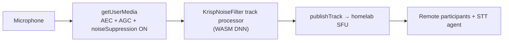

# Noise cancellation revamp + dev-only homelab STT plan

Related: [revamp-background-blur.plan.md](./revamp-background-blur.plan.md), [fix-live-call-video-scenarios.plan.md](./fix-live-call-video-scenarios.plan.md)

---

## Goals

| Goal | Success criteria |
|------|------------------|
| **NC revamp** | Loud background music + cheap mic → remote hears **your voice**, music suppressed (Meet-like) |
| **Dev STT only** | Captions from homelab Whisper agent; **no Gemini** live notes/tasks during development |
| **Debug-first** | Instrument before/after NC pipeline; verify with two-tab + music test matrix |

---

## Current state (OneWork)

### Noise cancellation — **not ML-based**

```8:18:src/lib/calls/microphoneAudioConfig.ts
/** LiveKit / getUserMedia audio constraints (noise suppression, AEC, AGC). */
export function liveKitAudioCaptureOptions(opts: {
  microphoneId?: string;
  noiseCancellationEnabled: boolean;
}): AudioCaptureOptions {
  return {
    ...(opts.microphoneId ? { deviceId: opts.microphoneId } : {}),
    echoCancellation: true,
    autoGainControl: true,
    noiseSuppression: opts.noiseCancellationEnabled,
  };
}
```

- Toggle in `LiveKitCallRoom.tsx` calls `replaceLocalAudioTrack()` — **unpublish → stop → recreate → publish** entire mic track.
- WebRTC `noiseSuppression` targets steady hum (fans, AC), **not** non-stationary noise like music.
- `@livekit/krisp-noise-filter` appears as optional peer dep in `pnpm-lock.yaml` but is **not installed or wired**.
- AEC/AGC always on; only `noiseSuppression` toggles.

**Why music test fails today:** Browser DSP ≠ DNN speech/noise separation. Cheap mics also bleed room audio; AGC can **boost** background music when you pause speaking.

### Transcription — **already homelab-capable**

| Layer | Implementation |
|-------|----------------|
| Agent | `services/livekit-agent/agent.py` — faster-whisper + Silero VAD, STT-only by default |
| Dispatch | `startLiveKitAgent()` on join via `lifecycle.ts` → homelab LiveKit (`NEXT_PUBLIC_LIVEKIT_URL`) |
| Client | `RoomEvent.TranscriptionReceived` → `handleTranscriptionSegment` → captions + local session |
| Gemini (avoid in dev) | Host `runLocalLiveNotes` → `POST /api/calls/[id]/live-ai` every ~60s + debounced on segments |

Agent voice LLM is already off unless `CALL_AI_VOICE_ASSISTANT=true`. **Client-side live notes/tasks** still hammer Gemini when host has `canWriteStt`.

---

## How Google Meet does it (target reference)

| Layer | Google Meet | OneWork today |
|-------|-------------|---------------|
| **Algorithm** | DNN trained on 10k+ hours; speech vs non-speech | WebRTC `noiseSuppression` boolean |
| **Processing site** | Client (device) + cloud denoiser on some paths | Browser capture constraints only |
| **Music handling** | Filters percussion/instruments; voice prioritized; amplitude-adaptive | Weak — music often passes or distorts voice |
| **Echo** | AEC + adaptive audio (multi-laptop rooms) | WebRTC `echoCancellation: true` |
| **Toggle** | Enable/disable processor without full track swap | Full mic track recreate on toggle |
| **Privacy** | On-device for client-side path (Krisp partnership) | N/A |

Meet explicitly: *“Meet cancels non-speech noises”* — music is treated as noise unless NC is off. For our test (music out loud + cheap mic + speak), we need **DNN post-capture processing**, not constraint flags alone.

Technical lineage: Meet’s denoiser shares DNA with **Krisp** (WASM in Chrome, 30ms frames, <3ms budget per sub-frame via buffering + XNNPACK).

---

## Recommended architecture (Meet-style for LiveKit)

### Audio chain (target)



**Principles (mirror blur revamp):**

1. **Keep WebRTC AEC/AGC always on** — handles echo/level; Krisp handles non-speech noise.
2. **Single published track** — attach processor once after `createLocalAudioTrack`; toggle via `processor.setEnabled()`, not track recreate.
3. **Apply on join + after mic device change** — re-attach processor when track swaps.
4. **Graceful fallback** — unsupported browser → WebRTC-only + UI badge “Enhanced NC unavailable”.

### Primary path: `@livekit/krisp-noise-filter`

| Item | Detail |
|------|--------|
| Package | `@livekit/krisp-noise-filter` ^0.4.x (~12 MB WASM) |
| Peer | `livekit-client` ^2.18.7 — we have ^2.19.2 ✓ |
| Integration | `await localAudioTrack.setProcessor(KrispNoiseFilter({ quality, bufferOverflowMs, ... }))` |
| Toggle | `processor.setEnabled(true/false)` — no unpublish |
| Support check | `isKrispNoiseFilterSupported()` before init |
| Reference | [livekit-examples/meet MicrophoneSettings.tsx](https://github.com/livekit-examples/meet/blob/main/lib/MicrophoneSettings.tsx) |

**Self-hosted LiveKit (VPS / Tailscale):**

- Krisp **frontend filter runs entirely in the browser** before audio hits the SFU — no Cloud requirement for basic NC model processing.
- LiveKit docs/hooks note **BVC (voice isolation)** and `useKrispNoiseFilter` may tie to **LiveKit Cloud** billing/features. For self-hosted SFU, plan on **standard Krisp NC** first; evaluate BVC separately if Cloud is added later.
- License: package is SEE LICENSE (LiveKit ToS) — acceptable for product use via official package.

**Quality options (from meet example):**

```ts
KrispNoiseFilter({
  quality: isLowPowerDevice() ? 'low' : 'medium', // or 'high' for music stress test
  bufferOverflowMs: 100,
  bufferDropMs: 200,
  onBufferDrop: () => { /* auto-disable on overload in >=0.3.2 */ },
});
```

### Fallback paths (if Krisp insufficient on self-hosted)

| Option | Pros | Cons |
|--------|------|------|
| **ai-coustics** (agent-side, own API key) | Works with self-hosted agents | Processes at agent, not before publish; remote still hears raw music |
| **RNNoise WASM** custom `TrackProcessor` | OSS, no license | Weaker on music vs Krisp; more integration work |
| **livekit-plugins-dtln** (community) | DTLN in agent pipeline | Same agent-side limitation |

**Recommendation:** Client-side Krisp NC first — only path that fixes **what remotes hear**, which is what the music test measures.

---

## Implementation plan — noise cancellation

### Phase 1 — Krisp track processor (core)

**New file:** `src/lib/calls/audioNoiseFilter.ts`

```ts
// Responsibilities:
// - lazy dynamic import('@livekit/krisp-noise-filter')
// - createKrispProcessor(options)
// - attachKrispToAudioTrack(track, enabled): Promise<KrispHandle>
// - setKrispEnabled(handle, enabled)
// - disposeKrisp(handle)
// - isEnhancedNoiseCancellationSupported(): boolean
```

**Changes:**

| File | Change |
|------|--------|
| `package.json` | Add `@livekit/krisp-noise-filter` dependency |
| `microphoneAudioConfig.ts` | Keep `noiseSuppression: true` when enhanced NC on (stack both); document why |
| `LiveKitCallRoom.tsx` | After `createLocalAudioTrack` in `joinRoom`, attach Krisp if `noiseCancellationOn`; store handle in ref |
| `LiveKitCallRoom.tsx` | `toggleNoiseCancellation` → `setKrispEnabled` instead of `replaceLocalAudioTrack` |
| `LiveKitCallRoom.tsx` | `replaceLocalAudioTrack` / mic device change → re-attach Krisp on new track |
| `PreJoinModal.tsx` | Optional: pre-join mic preview with Krisp (Phase 2) |
| `CallsSettings.tsx` | Copy: “Enhanced noise cancellation (AI)” vs browser-only fallback |

**Remove anti-pattern:** Toggling NC by recreating the entire published track causes audible glitch + STT/agent resubscribe churn.

### Phase 2 — Pre-join parity + UX

- Pre-join mic test uses same Krisp processor as in-call.
- Visual indicator when NC active (Meet-style ring on mic icon optional).
- Low-power device → default `quality: 'low'` (meet pattern).

### Phase 3 — Optional BVC / Cloud

- If LiveKit Cloud added: evaluate BVC for “voice only” when TV/other voices in room (Meet doc: TV voices **not** canceled by standard NC).
- Not required for initial music test.

---

## Dev-only homelab STT (no Gemini live AI)

### What stays on

- Homelab LiveKit + Python agent (`WHISPER_MODEL_SIZE=distil-large-v3` or `small.en` on 2GB VPS).
- Agent dispatch on join (`api.calls.join` after mic publish).
- `TranscriptionReceived` → captions overlay + `localSession.segments`.
- Persist transcript segments to DB when host (`canWriteStt` + dirty flush) — **optional gate** below.

### What to disable in dev

| Trigger | Current behavior | Dev flag off |
|---------|------------------|--------------|
| `runLocalLiveNotes` | Gemini `/live-ai` notes/tasks | Skip |
| 60s interval in `LiveKitCallRoom` | `scheduleLocalLiveNotes` | Skip |
| Segment debounce → live AI | via `shouldRunLocalLiveNotes` | Skip |
| Post-call Gemini | `runCallPostProcessing` / `runFinalMeetingAiPass` | Optional separate flag |

### Proposed env flags

```bash
# .env.local (development)
NEXT_PUBLIC_CALL_DEV_STT_ONLY=true   # client: skip live notes UI polling + runLocalLiveNotes
CALL_DEV_STT_ONLY=true               # server: reject or no-op /live-ai with 503 + message
CALL_AI_ENABLED=false                # existing — disables AI features at call level if needed
```

**Client gating (`LiveKitCallRoom.tsx`):**

```ts
const devSttOnly = process.env.NEXT_PUBLIC_CALL_DEV_STT_ONLY === 'true';
// Wrap: runLocalLiveNotes, scheduleLocalLiveNotes interval, live-ai sidebar task pipeline
// Still show captions from handleTranscriptionSegment
```

**Server gating (`/api/calls/[id]/live-ai/route.ts`):**

```ts
if (process.env.CALL_DEV_STT_ONLY === 'true') {
  return NextResponse.json({ error: 'Dev STT-only mode' }, { status: 503 });
}
```

**Homelab connectivity (Tailscale dev):**

```bash
# .env.local
NEXT_PUBLIC_LIVEKIT_URL=wss://5-78-232-172.sslip.io
LIVEKIT_URL=https://5-78-232-172.sslip.io
# Agent on same VPS or dev machine pointing at same LIVEKIT_URL
```

Ensure agent worker running: `cd services/livekit-agent && python agent.py dev`

---

## Debug instrumentation (next session)

Log file: `.cursor/debug-b87613.log` via debug ingest endpoint.

### Hypotheses for NC music test

| ID | Hypothesis | Log signal |
|----|------------|------------|
| **N1** | WebRTC-only NC passes music spectrum | `noiseSuppression: true` but no processor attached |
| **N2** | Track recreate drops processor state | Toggle logs show unpublish without Krisp reattach |
| **N3** | Krisp unsupported in browser | `isKrispNoiseFilterSupported() === false` |
| **N4** | Krisp buffer drops under load | `onBufferDrop` fires; quality too high |
| **N5** | AGC boosts music between speech | RMS delta on raw vs processed frames (optional) |

### Hypotheses for dev STT

| ID | Hypothesis | Log signal |
|----|------------|------------|
| **T1** | Agent not in room | `agentInRoom === false` after join |
| **T2** | Transcription gated by `call.ai_enabled` | `onTranscriptionReceived` early return |
| **T3** | Gemini still called | `/live-ai` request despite flag |
| **T4** | Whisper too slow on VPS | Agent logs caption latency |

### Instrumentation placements

1. `joinRoom` — after audio track create: `{ krispSupported, krispAttached, noiseSuppression }`
2. `toggleNoiseCancellation` — `{ method: 'processor'|'recreate', enabled }`
3. `handleTranscriptionSegment` — `{ textLen, isFinal, participantIdentity }` (no PII text in logs — length only)
4. `runLocalLiveNotes` entry — `{ skipped: devSttOnly }`
5. Agent join poll — `{ agentInRoom }`

---

## Test matrix

### Noise cancellation

| # | Setup | Action | Pass |
|---|-------|--------|------|
| NC-1 | Speaker playing music ~1m from cheap mic | Join with NC on, speak | Remote hears voice; music heavily attenuated |
| NC-2 | Same | Toggle NC off | Remote hears music + voice |
| NC-3 | Same | Toggle NC on again | No prolonged mute glitch (<500ms) |
| NC-4 | Chrome + Tailscale | Two tabs, A speaks, B listens | B confirms NC-1 |
| NC-5 | Safari/Firefox | Join | Fallback WebRTC-only OR Krisp works; no crash |

### Dev STT

| # | Setup | Action | Pass |
|---|-------|--------|------|
| STT-1 | `CALL_DEV_STT_ONLY=true`, agent running | Join, speak | Captions appear |
| STT-2 | Same | 2+ min call | No `/live-ai` network calls (DevTools) |
| STT-3 | Same | Agent indicator | `agentInRoom` true within 30s |
| STT-4 | Agent stopped | Join | Graceful “captions unavailable” (existing UX) |

---

## Rollout order

1. **Research doc** (this file) ✓
2. **Dev STT flag** — low risk, unblocks transcription testing without Gemini cost
3. **Install + wire Krisp** — core NC revamp
4. **Debug instrumentation** — validate hypotheses N1–N5, T1–T4
5. **Manual test matrix** — music + cheap mic + two tabs
6. **Remove debug logs** after user confirms
7. **Pre-join Krisp** (Phase 2) if in-call passes

---

## Risks & mitigations

| Risk | Mitigation |
|------|------------|
| Krisp WASM bundle size (+12MB) | Dynamic import; load on first call join |
| CPU on low-end laptops | `quality: 'low'`, disable on `isLowPowerDevice()` |
| BVC requires Cloud | Document; standard NC still beats WebRTC for music |
| Self-hosted agent cold start | Existing `AGENT_INITIALIZE_PROCESS_TIMEOUT=180` |
| License | Use official `@livekit/krisp-noise-filter` only |

---

## Files touched (implementation checklist)

- [x] `docs/plans/revamp-noise-cancellation-and-dev-stt.plan.md` (this doc)
- [x] `package.json` — `@livekit/krisp-noise-filter`
- [x] `src/lib/calls/audioNoiseFilter.ts` — new
- [x] `src/lib/calls/microphoneAudioConfig.ts` — constraint stacking notes
- [x] `src/components/calls/LiveKitCallRoom.tsx` — Krisp attach + dev STT gate
- [x] `src/lib/calls/constants.ts` — `isCallDevSttOnly()`
- [x] `src/app/api/calls/[id]/live-ai/route.ts` — server guard
- [x] `.env.example` — document new flags
- [x] Debug instrumentation (temporary)
