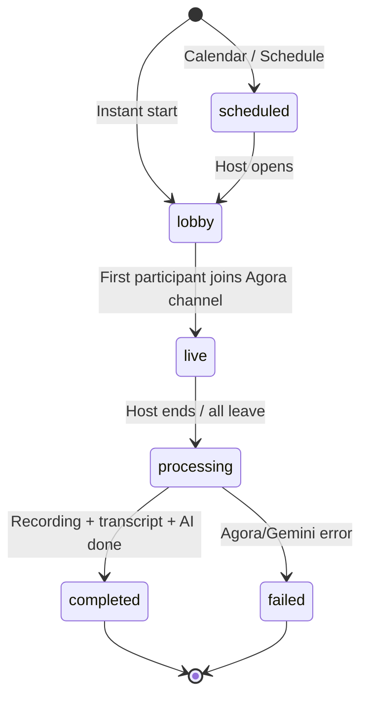
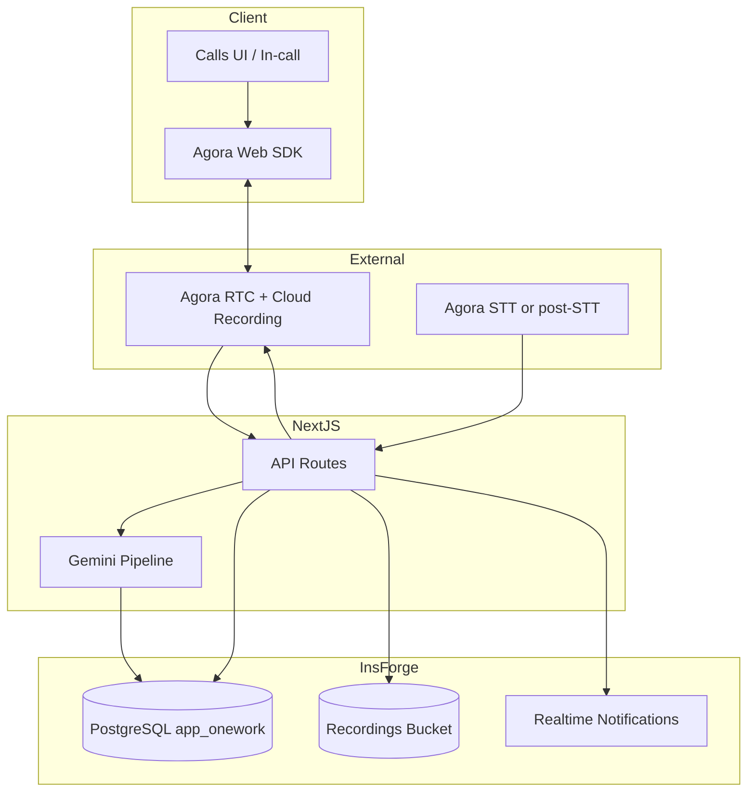

# Product Requirements Document (PRD)  
## OneWork — Live Video Calling with AI Meeting Assistant

| Field | Value |
|-------|--------|
| **Product** | OneWork (DevFlow Pro) |
| **Feature** | Workspace Video Calls + Background AI |
| **Version** | 1.0 (Draft) |
| **Status** | For review |
| **Stack context** | Next.js 16, InsForge (`app_onework`), existing Gemini (`GEMINI_API_KEY`) |
| **Vendor** | Agora (RTC + Cloud Recording + optional STT) |

---

## 1. Executive summary

OneWork will add **workspace-scoped live video calling** powered by **Agora**, exposed as a **dedicated navigation area adjacent to Email** (communications cluster). Calls support **1:1 and group** meetings for any member of the active workspace.

Every call supports **cloud recording and transcription**. A **background AI assistant** (not a visible/voice bot in the room) processes meeting audio/transcripts after or during the call to:

- Pull relevant **workspace context** (tasks, calendar, chat, email where permitted)
- **Auto-create tasks** with `status: backlog` for human review before promotion to active work
- Deliver **summaries and artifacts** via Notifications, Chat, Calendar, and Tasks

The feature must feel native to OneWork—not a bolt-on Zoom link—and reuse existing patterns: workspace membership, InsForge auth, notification preferences, task board statuses, and Gemini server routes.

---

## 2. Problem statement

Today OneWork coordinates work across **Tasks, Calendar, Chat, Email, and Notifications**, but collaboration still jumps to external tools for live discussion. Context from calls is lost unless someone manually creates tasks or posts summaries.

**Pain points:**

- No in-app way to meet with workspace teammates
- Meeting outcomes don’t flow into the task backlog automatically
- Calendar events lack a first-class “join call in OneWork” experience
- AI value (Gemini on email/tasks) doesn’t extend to meetings

---

## 3. Goals and non-goals

### 3.1 Goals

| ID | Goal |
|----|------|
| G1 | Enable **instant and scheduled** video calls within a workspace |
| G2 | Support **1:1 and multi-party (group)** calls, workspace-wide membership |
| G3 | Provide **recording + transcription** for every call (configurable retention) |
| G4 | Run **background AI** to summarize meetings and extract action items |
| G5 | **Auto-create tasks in `backlog`** with provenance; user reviews before treating as committed work |
| G6 | **Integrate** with Calendar, Chat, Notifications, Tasks, Email (where sensible), Global Search |
| G7 | Align with **InsForge** isolation (`app_onework` schema, RLS, shared `auth.users`) |

### 3.2 Non-goals (v1)

| ID | Non-goal |
|----|----------|
| NG1 | AI **voice agent** visible/speaking in the call (deferred; background only) |
| NG2 | **Project-only** calls without workspace context (v1 is workspace-scoped; optional `project_id` metadata only) |
| NG3 | **External guests** without OneWork accounts (future phase; v1 = authenticated workspace members) |
| NG4 | **Live translation** or real-time copilot UI during call (post-call artifacts first) |
| NG5 | Replacing **Email** or **Chat**—calls complement them |
| NG6 | **Mobile native apps** (responsive web in v1) |

---

## 4. Stakeholder decisions (confirmed)

These product decisions are **locked for v1** unless leadership overrides:

| Topic | Decision |
|-------|----------|
| Call types | **Both** 1:1 and group |
| Scope | **Workspace-wide** (any member of active workspace can be invited) |
| Recording | **Required** capability (on by default for scheduled; prompt for ad-hoc) |
| Transcription | **Required** (stored and linked to call record) |
| AI presence | **Background only**—no bot participant in the video grid *(superseded 2026-05-19: in-call Agora voice agent with visible tile — see `context/current-feature.md`)* |
| Task creation | **Auto-create** suggested tasks → **`backlog` status** → **review queue** before normal workflow |
| AI stack | **Primary:** existing **Gemini** pipeline on server; **Evaluate** Agora Agent Studio / Conversational AI for STT/orchestration only if it reduces cost/complexity |

---

## 5. Users and personas

| Persona | Needs |
|---------|--------|
| **Individual contributor** | Quick 1:1 with teammate; see summary and backlog tasks after |
| **Project lead** | Group sync tied to project; AI captures action items to backlog |
| **Workspace admin** | Control recording retention, who can start calls, audit |
| **Exec / PM** | Schedule via Calendar; join from notification; skim AI summary |

---

## 6. User stories

### 6.1 Calls

- **US-C01:** As a workspace member, I can **start an instant 1:1 call** with another member from their profile or Calls tab.
- **US-C02:** As a workspace member, I can **start a group call** and invite multiple workspace members.
- **US-C03:** As an invitee, I receive a **notification** and can join from Calls, Chat, or Calendar.
- **US-C04:** As a participant, I can **mute/unmute**, **toggle camera**, **share screen**, and **see participants**.
- **US-C05:** As host, I can **end the call for everyone** or leave while others continue (group).
- **US-C06:** As workspace member, I only see/join calls for **workspaces I belong to**.

### 6.2 Recording & transcription

- **US-R01:** As host, I am informed that the call **may be recorded** (consent banner).
- **US-R02:** As participant, after the call I can open the **recording** (if permitted) from call history.
- **US-R03:** As participant, I can read the **transcript** with speaker labels and timestamps.
- **US-R04:** As admin, I can set **retention period** for recordings/transcripts (workspace setting).

### 6.3 AI (background)

- **US-A01:** After a call ends, AI generates a **meeting summary** without joining the video UI.
- **US-A02:** AI extracts **action items** and creates tasks in **`backlog`** with source link to the call.
- **US-A03:** As user, I review AI-created tasks in a **“Meeting tasks — pending review”** panel and approve/edit/reject.
- **US-A04:** AI uses **workspace context** (open tasks, today’s calendar, recent chat channel if linked) to enrich summaries—not invent facts.
- **US-A05:** As user, I can **disable AI** for a specific call (host option) while still allowing recording.

### 6.4 Integrations

- **US-I01:** From **Calendar** event, I click **Join OneWork Call**.
- **US-I02:** From **Chat** channel/DM, I click **Start call** / **Join ongoing call**.
- **US-I03:** I receive **notifications** for invites, starting soon, call ended, summary ready, tasks to review.
- **US-I04:** Approved meeting tasks appear on **Tasks** board under Backlog with tag `meeting-ai`.
- **US-I05:** Optional: post **summary snippet** to linked Chat thread after call.

---

## 7. Functional requirements

### 7.1 Navigation and information architecture

**FR-NAV-01:** Add primary sidebar item **“Calls”** (icon: `videocam` or `video_call`) positioned **immediately after Email** in `navItems` (same visibility rules as Email for `no_workspace` / `workspace_no_project` modes).

**FR-NAV-02:** Route: `/calls` with sub-views:

| Sub-view | Route | Purpose |
|----------|--------|---------|
| Home | `/calls` | Start call, recent, ongoing |
| History | `/calls?tab=history` | Past calls, recordings, transcripts |
| Review | `/calls?tab=review` | AI-generated backlog tasks pending approval |
| Scheduled | `/calls?tab=scheduled` | Upcoming (Calendar-linked) |

**FR-NAV-03:** Register in **Global Search** (`MODULES`) as `{ key: "calls", label: "Calls", route: "/calls" }`.

**FR-NAV-04:** Optional nested nav under Calls (mirror Email folders pattern) if needed later; v1 uses **tabs** inside page.

---

### 7.2 Call lifecycle



| State | Description |
|-------|-------------|
| `scheduled` | Future call with `scheduled_at`, linked calendar `event_id` optional |
| `lobby` | Channel created; waiting for participants |
| `live` | Active Agora session |
| `processing` | Recording finalize, transcription, AI pipeline |
| `completed` | Artifacts available |
| `failed` | Partial failure; user sees retry / support message |
| `cancelled` | Scheduled call cancelled before start |

**FR-CALL-01:** **Instant call:** Host creates `call_session` → Agora channel name + token → invitees notified.

**FR-CALL-02:** **Scheduled call:** Created from Calls UI or Calendar event → reminders at T-15m, T-2m (notification).

**FR-CALL-03:** **1:1:** Exactly two workspace members; channel locked after both invited.

**FR-CALL-04:** **Group:** 3–N participants (v1 cap: **50** participants—configurable).

**FR-CALL-05:** **Workspace gate:** `workspace_id` required; RLS ensures only `workspace_members` access.

**FR-CALL-06:** **Optional `project_id`:** Filter history and AI context to project when set; null = workspace-level call.

**FR-CALL-07:** **Host controls:** mute all (group), end call, toggle recording (if not always-on), toggle AI processing.

**FR-CALL-08:** **Participant roles:** `host`, `cohost`, `participant` (v1: host + participant sufficient).

**FR-CALL-09:** **Rejoin:** If call still `live`, late join via same link/token refresh.

**FR-CALL-10:** **Idle timeout:** `live` → `processing` when last participant leaves or 30s grace elapsed.

---

### 7.3 Agora integration

**FR-AG-01:** Use **Agora Web SDK 4.x** (or current stable) in client components (`"use client"`).

**FR-AG-02:** Server issues **short-lived RTC tokens** via `/api/calls/[id]/token` (never expose App Certificate client-side).

**FR-AG-03:** Channel naming: `onework_{workspaceId}_{callId}` (no PII in channel name).

**FR-AG-04:** **Cloud Recording** via Agora RESTful API; composite layout (grid or speaker); audio + video.

**FR-AG-05:** Recording files stored in **InsForge Storage** (S3-compatible) under bucket `call-recordings` with workspace-scoped paths.

**FR-AG-06:** Use Agora **Real-Time Speech-to-Text** or post-recording transcription service; fallback: transcribe recording via Gemini multimodal or third-party STT if Agora STT unavailable in region.

**FR-AG-07:** Environment variables (add to `.env.example`):

```bash
AGORA_APP_ID=
AGORA_APP_CERTIFICATE=          # server only
AGORA_CUSTOMER_ID=              # REST / recording
AGORA_CUSTOMER_SECRET=          # server only
AGORA_RECORDING_REGION=         # e.g. US, AP
CALL_RECORDING_ENABLED=true
CALL_MAX_DURATION_MINUTES=120
```

---

### 7.4 Recording and transcription

**FR-REC-01:** **Consent UI** before joining: “This meeting may be recorded and transcribed for your workspace.” Host must accept; participants acknowledge.

**FR-REC-02:** **Default:** recording enabled for scheduled calls; ad-hoc calls show host toggle (default ON per stakeholder decision).

**FR-REC-03:** Store metadata: `recording_url`, `duration_seconds`, `file_size_bytes`, `storage_key`, `agora_recording_sid`.

**FR-REC-04:** **Transcript** entity: segments `{ speaker_user_id, text, start_ms, end_ms, confidence }`.

**FR-REC-05:** Transcript full-text searchable from Calls history (workspace scoped).

**FR-REC-06:** **Retention:** workspace setting `call_recording_retention_days` (default 90); cron/job deletes storage + DB references.

**FR-REC-07:** Download recording/transcript only for **host + workspace admins** (configurable).

---

### 7.5 Background AI pipeline

**FR-AI-01:** AI does **not** publish audio/video to Agora channel in v1.

**FR-AI-02:** Trigger: call → `processing` → enqueue job `process_call_ai(call_id)`.

**FR-AI-03:** Inputs:

1. Full transcript (required)
2. Call metadata (title, participants, duration, `project_id`)
3. **Context bundle** (read-only):
   - Tasks: open/in-progress for workspace or project (limit 30)
   - Calendar: events ±7 days for participants
   - Chat: last 50 messages if `conversation_id` linked
   - Email: **none by default** in v1 (privacy); optional future with explicit link

**FR-AI-04:** Gemini prompt outputs **strict JSON**:

```json
{
  "summary": "string, max 3 sentences",
  "keyDecisions": ["string"],
  "actionItems": [
    {
      "title": "string",
      "description": "string",
      "suggestedAssigneeId": "uuid | null",
      "suggestedPriority": "urgent|high|medium|low",
      "suggestedDueDate": "ISO date | null",
      "confidence": 0.0
    }
  ],
  "referencedTaskIds": ["uuid"],
  "risks": ["string"]
}
```

**FR-AI-05:** Reuse `getGeminiModelId()`, `mapGeminiClientError()`, rate limits (pattern from `/api/email/[id]/ai`).

**FR-AI-06:** **Hallucination guard:** system instruction: “Only use facts from transcript and context bundle; if unsure, omit.”

**FR-AI-07:** For each `actionItem`, **auto-insert task**:

| Field | Value |
|-------|--------|
| `status` | `backlog` |
| `workspace_id` | call workspace |
| `project_id` | call project or null |
| `title` / `description` | from AI |
| `assignee_id` | suggested or host |
| `tags` | `["meeting-ai", "pending-review"]` |
| `source` | `meeting_call_id` (new column or `metadata` JSONB) |

**FR-AI-08:** Insert into **`meeting_task_reviews`** (or flag on task) with `review_status: pending` until user acts.

**FR-AI-09:** **Review actions:** Approve → remove `pending-review` tag, optionally move to `todo`; Edit → PATCH task; Reject → delete or archive task.

**FR-AI-10:** Notify **host + assignees**: “N meeting tasks ready for review.”

**FR-AI-11:** Host can set `ai_enabled: false` on call → skip task creation; summary optional.

**FR-AI-12:** Log AI run: model id, token usage estimate, latency, errors.

---

### 7.6 Task review workflow (backlog)

**FR-TASK-01:** AI-created tasks **only** land in `backlog` (existing `Status` type in `src/types.ts`).

**FR-TASK-02:** **Review UI** at `/calls?tab=review` lists pending items grouped by call.

**FR-TASK-03:** Bulk actions: Approve all, Reject all for a call.

**FR-TASK-04:** Task detail shows **“Created from meeting”** with link to transcript timestamp if available.

**FR-TASK-05:** Activity log on task: `source: meeting_ai`, `call_id`, `approved_by`.

---

## 8. Cross-feature integration requirements

### 8.1 Calendar

| ID | Requirement |
|----|-------------|
| CAL-01 | Extend `events` (or junction table) with optional `call_session_id` |
| CAL-02 | Event modal: “Add OneWork video call” → creates linked scheduled call |
| CAL-03 | Event detail: **Join call** when `live` or `lobby` within join window (15 min before – 30 min after end) |
| CAL-04 | On call `completed`, append AI summary to event `description` or `metadata` (append-only) |
| CAL-05 | Cancel event → cancel scheduled call |

### 8.2 Chat

| ID | Requirement |
|----|-------------|
| CH-01 | Channel header + DM header: **Video call** button |
| CH-02 | Starting call from chat sets `conversation_id` on call |
| CH-03 | System message in chat: “Call started” / “Call ended” with link |
| CH-04 | Optional post-call: host posts AI summary to thread (button, not automatic in v1) |

### 8.3 Notifications

| ID | Requirement |
|----|-------------|
| N-01 | New notification types: `call_invite`, `call_reminder`, `call_summary`, `meeting_tasks_review` |
| N-02 | Extend `Notification.type` union in `src/types.ts` |
| N-03 | Routes: `/calls/[id]`, `/calls?tab=review` |
| N-04 | Respect `NotificationPreferences`—new section **“Calls & meetings”** in settings |
| N-05 | Realtime via existing `realtime-notifications` InsForge channel |

### 8.4 Tasks

| ID | Requirement |
|----|-------------|
| T-01 | Backlog column shows AI tasks with badge “Meeting” |
| T-02 | Filter: `tag:meeting-ai`, `tag:pending-review` |
| T-03 | No auto-notification to assignee until **approved** (avoid noise) |

### 8.5 Email

| ID | Requirement |
|----|-------------|
| E-01 | v1: no deep integration |
| E-02 | Future: detect calendar invites in mail → suggest OneWork call (out of scope v1) |

### 8.6 Files

| ID | Requirement |
|----|-------------|
| F-01 | Recordings appear in workspace Files under `/Calls/Recordings/{callId}` virtual folder OR linked from Calls only in v1 |

### 8.7 Dashboard & Analytics

| ID | Requirement |
|----|-------------|
| D-01 | Dashboard widget: “Upcoming calls today” |
| AN-01 | Analytics: call minutes per workspace, AI tasks approved vs rejected (phase 2) |

---

## 9. UX requirements

### 9.1 Calls home (`/calls`)

- **Primary CTA:** “New call” → modal: 1:1 vs Group, pick participants (workspace member picker), optional project, optional link to chat channel
- **Ongoing:** card with Join + participant count (realtime)
- **Recent:** last 10 with status chips (`completed`, `processing`)

### 9.2 In-call UI

- Video grid (1–4 prominent, paginate beyond)
- Bottom bar: mic, camera, screen share, participants list, chat sidebar (optional v1.1), end call
- Top: call title, timer, recording indicator (red dot)
- **No AI avatar**

### 9.3 Post-call

- Redirect to **Call detail** page: summary, transcript, recording player, “Review N tasks”

### 9.4 Accessibility

- Keyboard shortcuts for mute (M), camera (V)
- Captions: show live captions if STT streaming available; else transcript post-call
- WCAG contrast on controls

### 9.5 Empty / error states

- No `GEMINI_API_KEY`: AI disabled banner; recording still works
- Agora misconfig: block start with clear admin message
- Permission denied: camera/mic instructions

---

## 10. Data model (proposed)

Schema: `app_onework` (new migration file).

### 10.1 `call_sessions`

| Column | Type | Notes |
|--------|------|-------|
| `id` | UUID PK | |
| `workspace_id` | UUID FK | required |
| `project_id` | UUID FK nullable | |
| `conversation_id` | UUID FK nullable | chat link |
| `calendar_event_id` | UUID FK nullable | |
| `created_by` | UUID FK | host |
| `title` | TEXT | |
| `type` | TEXT | `instant_1_1`, `instant_group`, `scheduled` |
| `status` | TEXT | see lifecycle |
| `agora_channel_name` | TEXT | |
| `scheduled_start_at` | TIMESTAMPTZ nullable | |
| `scheduled_end_at` | TIMESTAMPTZ nullable | |
| `started_at` | TIMESTAMPTZ nullable | |
| `ended_at` | TIMESTAMPTZ nullable | |
| `recording_enabled` | BOOLEAN | default true |
| `ai_enabled` | BOOLEAN | default true |
| `metadata` | JSONB | |
| `created_at` / `updated_at` | TIMESTAMPTZ | |

### 10.2 `call_participants`

| Column | Type | Notes |
|--------|------|-------|
| `id` | UUID PK | |
| `call_session_id` | UUID FK | |
| `user_id` | UUID FK | |
| `role` | TEXT | host, participant |
| `joined_at` | TIMESTAMPTZ nullable | |
| `left_at` | TIMESTAMPTZ nullable | |

### 10.3 `call_recordings`

| Column | Type | Notes |
|--------|------|-------|
| `id` | UUID PK | |
| `call_session_id` | UUID FK | |
| `storage_key` | TEXT | |
| `playback_url` | TEXT | signed URL cached |
| `duration_seconds` | INT | |
| `agora_resource_id` | TEXT | |
| `status` | TEXT | `recording`, `uploaded`, `failed` |

### 10.4 `call_transcripts`

| Column | Type | Notes |
|--------|------|-------|
| `id` | UUID PK | |
| `call_session_id` | UUID FK | |
| `full_text` | TEXT | |
| `segments` | JSONB | array of segments |
| `language` | TEXT | default `en` |
| `status` | TEXT | `processing`, `ready`, `failed` |

### 10.5 `call_ai_artifacts`

| Column | Type | Notes |
|--------|------|-------|
| `id` | UUID PK | |
| `call_session_id` | UUID FK | |
| `summary` | TEXT | |
| `key_decisions` | JSONB | |
| `raw_response` | JSONB | audit |
| `model_id` | TEXT | |
| `status` | TEXT | |
| `created_at` | TIMESTAMPTZ | |

### 10.6 `meeting_task_reviews`

| Column | Type | Notes |
|--------|------|-------|
| `id` | UUID PK | |
| `call_session_id` | UUID FK | |
| `task_id` | UUID FK | |
| `review_status` | TEXT | `pending`, `approved`, `rejected` |
| `reviewed_by` | UUID nullable | |
| `reviewed_at` | TIMESTAMPTZ nullable | |
| `ai_confidence` | NUMERIC nullable | |

### 10.7 RLS policies (principles)

- SELECT/INSERT/UPDATE on call tables: user must exist in `workspace_members` for `workspace_id`
- Recordings/transcripts: host + participants + workspace owner/admin
- Service role for Agora webhooks and AI worker only via API routes

### 10.8 Tasks table extension

Add nullable `source_call_id UUID REFERENCES call_sessions(id)` OR store in existing `metadata` JSONB if tasks table already supports it—implementation choice at build time.

---

## 11. API specification (outline)

| Method | Endpoint | Purpose |
|--------|----------|---------|
| GET | `/api/calls?workspaceId=` | List calls |
| POST | `/api/calls` | Create instant/scheduled |
| GET | `/api/calls/[id]` | Detail + artifacts |
| PATCH | `/api/calls/[id]` | Update title, cancel, end |
| POST | `/api/calls/[id]/token` | Agora RTC token for user |
| POST | `/api/calls/[id]/join` | Register participant |
| POST | `/api/calls/[id]/leave` | Participant left |
| POST | `/api/calls/[id]/recording/start` | Start cloud recording |
| POST | `/api/calls/[id]/recording/stop` | Stop recording |
| POST | `/api/webhooks/agora/recording` | Recording status callback |
| POST | `/api/webhooks/agora/stt` | Transcript segments (if streaming) |
| POST | `/api/calls/[id]/process-ai` | Internal: trigger Gemini pipeline |
| GET | `/api/calls/[id]/transcript` | Get transcript |
| GET | `/api/calls/reviews?workspaceId=` | Pending meeting tasks |
| POST | `/api/calls/reviews/[id]/approve` | Approve task |
| POST | `/api/calls/reviews/[id]/reject` | Reject task |

All routes: `getUserFromRequest` auth pattern used elsewhere.

---

## 12. Security, privacy, and compliance

| ID | Requirement |
|----|-------------|
| SEC-01 | Tokens expire ≤ 24h; refresh on join |
| SEC-02 | Recordings encrypted at rest (InsForge storage default) |
| SEC-03 | **Consent** logged per participant (`consent_at` on `call_participants`) |
| SEC-04 | Workspace setting: **who can start calls** (`all_members` / `admins_only`) |
| SEC-05 | AI context excludes email bodies unless explicit future consent |
| SEC-06 | GDPR export/delete: deleting user scrubs PII from transcripts (redact or delete segments) |
| SEC-07 | Audit log: call created, recording started, AI run, task approved |
| SEC-08 | Rate limit AI: 10 calls/user/day (tuneable) |

---

## 13. Technical architecture



**Recommended v1 approach:**

1. **Agora** for media + cloud recording  
2. **Transcription:** Agora real-time STT during call OR batch STT when recording completes  
3. **AI:** Server-side **Gemini** on transcript + context (consistent with email/task AI)  
4. **Do not** use Agora Conversational AI as in-call voice agent in v1; revisit for STT-only if pricing/quality wins

---

## 14. Phased delivery plan

### Phase 1 — MVP (6–8 weeks target, team-dependent)

- Calls tab, instant 1:1 + group, Agora AV
- Token service, basic in-call UI
- Cloud recording → storage
- Transcript (batch)
- Calendar join link (basic)
- Chat “start call”
- Notifications: invite, ended

### Phase 2 — AI & review (3–4 weeks)

- Background Gemini pipeline
- Auto backlog tasks + review UI
- Call detail with summary/transcript
- Notification: tasks to review

### Phase 3 — Polish (2–3 weeks)

- Scheduled calls + reminders
- Retention policies
- Dashboard widget
- Screen share, participant controls
- Settings: Calls preferences

### Phase 4 — Future

- External guests (magic link)
- Live captions
- Agora Agent evaluation for STT
- Email ↔ call linking
- Analytics

---

## 15. Success metrics

| Metric | Target (90 days post-launch) |
|--------|------------------------------|
| % workspace members starting ≥1 call/month | 40% active workspaces |
| Median join time | < 15 seconds |
| Recording success rate | > 95% |
| Transcript ready < 10 min after call | 90% |
| AI task approval rate | > 60% approved vs rejected |
| Support tickets re: calls | < 5% of MAU |

---

## 16. Risks and mitigations

| Risk | Mitigation |
|------|------------|
| Agora cost at scale | Caps on duration/participants; flash-lite Gemini |
| STT accuracy | Human review queue; edit transcript before AI |
| AI hallucinated tasks | Strict JSON schema; backlog-only; pending-review tag |
| Privacy concerns | Consent banner, retention settings, disable AI per call |
| Browser codec issues | Document supported browsers; fallback audio-only |

---

## 17. Open questions (for leadership)

1. **Recording default for ad-hoc:** always on, or host opt-in each time? (PRD assumes on with consent.)
2. **Max group size** for v1: 25 vs 50?
3. **Assignee notifications:** notify on approve only—confirm?
4. **Regional data residency** for Agora (APAC vs US)?
5. **Budget** for Agora recording minutes + Gemini tokens per workspace tier?

---

## 18. Acceptance criteria (v1 release)

- [ ] Workspace member can complete a **1:1** and **group** call with video/audio
- [ ] Call appears under **Calls** nav (after Email)
- [ ] Recording playable from call history within policy
- [ ] Transcript available with speaker attribution
- [ ] AI summary generated **without** AI in video grid
- [ ] Action items create tasks in **`backlog`** with **`pending-review`**
- [ ] User can **approve/reject** from `/calls?tab=review`
- [ ] **Calendar** event can link to join call
- [ ] **Chat** can start call and show system messages
- [ ] **Notifications** fire for invite, end, and review ready
- [ ] RLS prevents cross-workspace access
- [ ] Works with existing InsForge auth and `GEMINI_API_KEY`

---

## 19. Appendix A — Environment variables (full list)

```bash
# Agora (new)
AGORA_APP_ID=
AGORA_APP_CERTIFICATE=
AGORA_CUSTOMER_ID=
AGORA_CUSTOMER_SECRET=
AGORA_RECORDING_REGION=

# Feature flags (new)
CALL_RECORDING_ENABLED=true
CALL_AI_ENABLED=true
CALL_MAX_PARTICIPANTS=50
CALL_MAX_DURATION_MINUTES=120

# Existing (used by AI)
GEMINI_API_KEY=
GEMINI_MODEL=
```

---

## 20. Appendix B — Mapping to current codebase

| Existing asset | Use in this feature |
|----------------|---------------------|
| `src/components/Sidebar.tsx` `navItems` | Add Calls after Email |
| `src/types.ts` `Status: "backlog"` | AI task destination |
| `src/app/api/tasks/route.ts` | Create tasks post-AI |
| `src/app/api/email/[id]/ai/route.ts` | Pattern for Gemini JSON + rate limit |
| `src/lib/ai/geminiModel.ts`, `geminiErrors.ts` | Reuse |
| `src/context/AppContext.tsx` realtime notifications | New INSERT handlers |
| `src/app/(dashboard)/calendar/` + `events` API | Schedule + join |
| `src/app/(dashboard)/chat/` | Start call, link `conversation_id` |
| `SETUP_DATABASE.sql` / migrations | New call_* tables + RLS |
