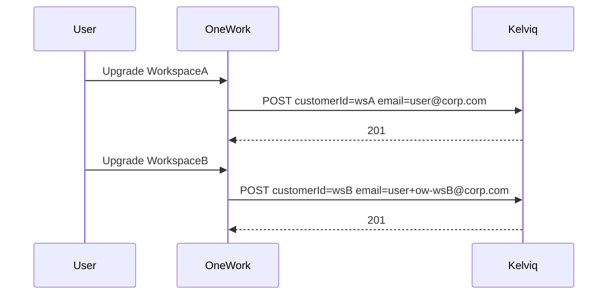

# Multi-workspace billing (same account, independent upgrades)

**Status:** Phase 1 + Phase 2 on `fix/multi-workspace-kelviq-customer`  
**OneWork-only fix** — no Kelviq ticket or API change required.

---

## Kelviq vs OneWork — who needs to change?

| | Kelviq | OneWork |
|---|--------|---------|
| **Platform rule** | One customer record per unique email per merchant | We reused login email for every workspace customer |
| **Multi-workspace model** | Many customers; external `customerId` = workspace UUID | Already 1:1 `billing_customers` per workspace |
| **What failed** | Correctly rejected duplicate email on POST | Same email twice; weak 400 recovery; wrong list filter in some paths |
| **Fix** | None | Unique Kelviq-facing email per workspace + hardened create/lookup |

See also [billing-deferred-work.md](../billing-deferred-work.md) for unrelated Kelviq quirks (cancel, webhook ID shapes).

---

## Root cause

Second workspace upgrade: `POST /customers/` with same `user.email` → Kelviq `400` email already exists → checkout 500.

Recovery in `src/lib/integrations/kelviq/client.ts` only handled `customerId` already exists, not `email`. List recovery used `?customerId=` instead of `?customer_id=`.

---

## Target behavior

- One auth user, many workspaces, each workspace upgrades independently.
- One Kelviq customer per workspace (`customerId` = `workspace_id`).
- Real user email in `billing_customers.billing_email` for UI; derived unique email for Kelviq API only.
- Per-workspace plans when joining other workspaces (already worked); Phase 1 fixes **upgrade checkout** for additional workspaces.

---

## Existing production customers (Phase 1 — do not break)

| Scenario | Behavior after Phase 1 |
|----------|-------------------------|
| Workspace already upgraded (`kelviq_customer_id` NOT NULL) | Checkout skips `createOrGetCustomer` — no Kelviq email change, no re-create |
| Kelviq customer created with real login email (historical) | Leave as-is — do not PATCH Kelviq email on existing customers |
| New workspace upgrade (no `kelviq_customer_id`) | Scoped Kelviq email on POST only |
| Failed prior B upgrade (`kelviq_customer_id` null) | Retry checkout uses scoped email |
| Asymmetric emails (A=real, B=plus) | Acceptable — Kelviq requires unique emails only |

**Phase 2 storage:** `kelviq_customer_id` = workspace UUID; `kelviq_customer_internal_id` = Kelviq internal id.

---

## Phase 1 implementation checklist

- [x] `src/lib/billing/kelviq-customer-email.ts` — plus-address or fallback per workspace
- [x] Harden `createOrGetCustomer`: GET `?customer_id={workspaceId}` first; recover on email or customerId 400
- [x] Wire checkout — scoped Kelviq email; real email in `billing_email`
- [ ] Manual two-workspace upgrade test (sandbox)

---

## Phase 2 implementation checklist

- [x] `sql/billing_customer_id_phase2_migration.sql` + `SETUP_DATABASE.sql`
- [x] `scripts/backfill-kelviq-customer-ids.ts`
- [x] `src/lib/billing/kelviq-customer-refs.ts` — dual lookup, API/external id helpers
- [x] Webhook `resolveWorkspaceIdFromCustomerRef` + `extractCustomerRef` + `syncKelviqCustomerRefs` on subscription events
- [x] Checkout / portal / summary / reconcile wired
- [ ] Run migration + backfill on target DB before deploy
- [ ] Manual: checkout Pro → non-null `billing_events.workspace_id` + active subscription

---

## Is your expectation impossible with our design?

**No.** Each workspace has `billing_customers` + `workspace_subscriptions`. Failure is at Kelviq customer create, not the data model.

---

## Phase 1 fix (shipped on branch)

### 1. Workspace-scoped email sent to Kelviq only

- `user+ow-{first8OfWorkspaceUuid}@domain.com` when possible
- Fallback: `ow-{workspaceId}@billing.{KELVIQ_BILLING_EMAIL_DOMAIN}` (default `onework.local` for dev)
- Keep `billing_customers.billing_email` as real user email

### 2. Harden `createOrGetCustomer`

1. GET `/customers/?customer_id={workspaceId}` first
2. POST with scoped Kelviq email + `customerId: workspaceId`
3. On 400, recover if customerId or email already exists → re-fetch by `customer_id`

---

## What we are not doing

- One Kelviq customer shared across all workspaces for the same user
- Requiring webhooks to start checkout

---

## Deploy order (Phase 2)

1. `sql/billing_customer_id_phase2_migration.sql`
2. `npx tsx scripts/backfill-kelviq-customer-ids.ts`
3. Deploy application

## Key files

- `src/lib/billing/kelviq-customer-email.ts`
- `src/lib/billing/kelviq-customer-refs.ts`
- `src/lib/integrations/kelviq/client.ts`
- `src/app/api/billing/checkout/route.ts`
- `src/app/api/billing/kelviq/webhook/route.ts`
