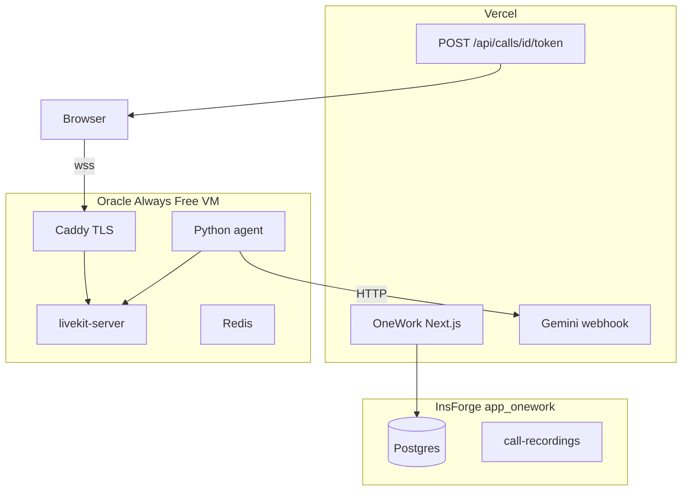

# LiveKit production setup (Option B)

Step-by-step operator runbook for self-hosted LiveKit on Oracle Always Free + Vercel + InsForge.

## Overview



**Monthly cost:** $0 VM tier + existing Vercel/InsForge/Gemini.

## Prerequisites

- [ ] Domain you control (e.g. `livekit.calls.yourdomain.com`)
- [ ] Oracle Cloud account (Always Free eligible)
- [ ] InsForge CLI linked: `npx @insforge/cli current`
- [ ] Vercel project access for OneWork env vars
- [ ] Docker + Compose on the VM only (not required on dev Mac)

## 1. Oracle Cloud — create VM

1. Console → Compute → Instances → Create.
2. **Region:** `us-east` (Ashburn) near InsForge `us-east`.
3. **Shape:** Ampere A1 Flex — 2 OCPU / 12 GB RAM (within free quota).
4. **Image:** Ubuntu 22.04 or 24.04 ARM64.
5. Add SSH public key; assign **public IPv4**.
6. Note the public IP: `VM_PUBLIC_IP`.

## 2. Networking — security list / firewall

Open ingress on the VCN security list and instance firewall:

| Protocol | Port(s) | Purpose |
|----------|---------|---------|
| TCP | 22 | SSH |
| TCP | 80, 443 | Caddy / TLS |
| TCP | 7880, 7881 | LiveKit signal / RTC TCP |
| UDP | 3478 | TURN |
| UDP | 50000–50100 | WebRTC media |

Verify from your laptop:

```bash
nc -zv VM_PUBLIC_IP 443
nc -zv VM_PUBLIC_IP 7880
```

## 3. DNS

Create an A record:

```
livekit.calls.yourdomain.com  →  VM_PUBLIC_IP
```

Wait for propagation, then:

```bash
dig +short livekit.calls.yourdomain.com
```

## 4. VM bootstrap

```bash
ssh ubuntu@VM_PUBLIC_IP
sudo apt update && sudo apt upgrade -y
sudo apt install -y docker.io docker-compose-v2 git
sudo usermod -aG docker ubuntu
```

Create deploy user (optional hardening):

```bash
sudo adduser deploy
sudo usermod -aG docker deploy
```

Copy stack files to VM:

```bash
rsync -avz services/livekit/ deploy@VM_PUBLIC_IP:/opt/onework/livekit/
rsync -avz --exclude '.venv' --exclude '.cache' --exclude '__pycache__' \
  services/livekit-agent/ deploy@VM_PUBLIC_IP:/opt/onework/livekit-agent/
```

## 5. LiveKit API keys

On the VM:

```bash
docker run --rm livekit/livekit-server generate-keys
```

Save output — **never commit**:

- `LIVEKIT_API_KEY`
- `LIVEKIT_API_SECRET`

## 6. Deploy stack

Edit `/opt/onework/livekit/Caddyfile` — set your domain.

Edit `/opt/onework/livekit/livekit.yaml` — confirm `use_external_ip: true` and Redis address.

Create `.env` on VM (not in git):

```bash
LIVEKIT_API_KEY=<from generate-keys>
LIVEKIT_API_SECRET=<from generate-keys>
```

```bash
cd /opt/onework/livekit
docker compose -f docker-compose.prod.yml up -d
docker compose -f docker-compose.prod.yml ps
```

Confirm TLS:

```bash
curl -I https://livekit.calls.yourdomain.com
```

## 7. InsForge secrets

```bash
npx @insforge/cli secrets add LIVEKIT_API_KEY <key>
npx @insforge/cli secrets add LIVEKIT_API_SECRET <secret>
npx @insforge/cli secrets add CALL_AI_LLM_WEBHOOK_SECRET <openssl rand -hex 32>
```

Apply DB migration if not done:

```bash
npx @insforge/cli db migrations up
```

## 8. Vercel production env

| Variable | Example (redacted) |
|----------|-------------------|
| `NEXT_PUBLIC_LIVEKIT_URL` | `wss://livekit.calls.yourdomain.com` |
| `LIVEKIT_URL` | `https://livekit.calls.yourdomain.com` |
| `LIVEKIT_API_KEY` | (from generate-keys) |
| `LIVEKIT_API_SECRET` | (from generate-keys) |
| `LIVEKIT_AGENT_NAME` | `onework-meeting-assistant` |
| `CALL_AI_LLM_WEBHOOK_SECRET` | (same as InsForge) |
| `CALL_RECORDING_ENABLED` | `true` |
| `CALL_AI_ENABLED` | `true` |

Redeploy Vercel after env changes.

Remove legacy `AGORA_*` variables from Vercel.

## 9. Python agent on VM

```bash
cd /opt/onework/livekit-agent
python3 -m venv .venv
source .venv/bin/activate
pip install -r requirements.txt
cp .env.example .env
```

Edit `.env`:

```bash
LIVEKIT_URL=wss://livekit.calls.yourdomain.com
LIVEKIT_API_KEY=...
LIVEKIT_API_SECRET=...
NEXT_PUBLIC_APP_URL=https://your-app.vercel.app
CALL_AI_LLM_WEBHOOK_SECRET=...
WHISPER_MODEL_SIZE=distil-large-v3
```

Install systemd unit (see `services/livekit-agent/README.md`), then:

```bash
sudo systemctl enable --now onework-livekit-agent
```

## 10. Smoke tests

1. [example.livekit.io](https://example.livekit.io) → custom URL `wss://livekit.calls.yourdomain.com` with prod keys.
2. Two browsers on staging Vercel URL → join call → audio/video.
3. Confirm live captions in sidebar (agent dispatched).
4. Host leaves → recording uploads to InsForge `call-recordings` bucket.

## 11. Cutover checklist

- [ ] `pnpm build` green on `main`
- [ ] DB migration applied (`livekit_*` columns present)
- [ ] Drop Agora migration applied only after backup: `20260609120100_app-onework-drop-agora-columns.sql`
- [ ] Vercel env uses LiveKit URLs only
- [ ] Monitor first 5 production calls
- [ ] Rollback: restore Agora env + redeploy previous release (if kept)

## 12. Operations

```bash
# Restart SFU stack
cd /opt/onework/livekit && docker compose -f docker-compose.prod.yml restart

# Agent logs
journalctl -u onework-livekit-agent -f

# LiveKit logs
docker compose -f docker-compose.prod.yml logs -f livekit
```

Recordings and transcripts live in InsForge — VM state is disposable except config + keys backup.

## 13. Troubleshooting

| Symptom | Check |
|---------|-------|
| ICE failed | UDP 50000–50100 open; TURN on 3478; `use_external_ip: true` |
| Agent not joining | Redis up; `LIVEKIT_AGENT_NAME` matches; dispatch ID in `call_sessions` |
| No captions | Agent logs; Whisper CPU load; `CALL_AI_ENABLED=true` |
| LLM errors | `CALL_AI_LLM_WEBHOOK_SECRET` matches Vercel + agent `.env` |
| Token 500 | `LIVEKIT_API_KEY` / `LIVEKIT_API_SECRET` on Vercel |
