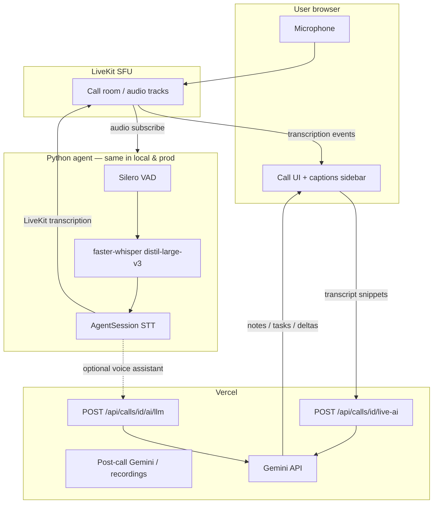

# LiveKit agent: Whisper STT, LLM, and how they connect

How OneWork turns speech into **live captions** during a call, and how that relates to **Gemini (LLM)** on Vercel. Complements [livekit-sfu-hosting-comparison.md](./livekit-sfu-hosting-comparison.md) (where the agent runs) and [services/livekit-agent/README.md](../../../services/livekit-agent/README.md) (operator quickstart).

---

## Whisper model we use (local → prod)

Production uses the **same Python agent** as local dev (`services/livekit-agent`). The default speech model is unchanged between environments unless you override env vars on the server.

| Setting | Default (local & prod) | Notes |
|---------|------------------------|-------|
| **Model** | **`distil-large-v3`** | [faster-whisper](https://github.com/SYSTRAN/faster-whisper) weights (`Systran/faster-distil-whisper-large-v3`). Distilled variant of Whisper large-v3: strong accuracy with lower CPU cost than full `large-v3`. |
| **Library** | `faster-whisper` | CTranslate2-backed inference; not the raw OpenAI Whisper Python package. |
| **Language** | `en` | `WHISPER_LANGUAGE` |
| **Device** | `auto` → CPU, or **CUDA** if GPU present | `WHISPER_DEVICE` |
| **Compute (CPU)** | `int8` on ARM64; `int8_float16` on x86 | `WHISPER_COMPUTE_TYPE` overrides |
| **Compute (CUDA)** | `float16` | When `WHISPER_DEVICE=cuda` |
| **Beam search** | `3` (`whisper_config.py` default) | `.env.example` suggests `5` for local tuning |
| **Initial prompt** | OneWork meeting vocabulary (projects, tasks, PRs, etc.) | Improves recognition of domain words |
| **VAD** | Silero (`livekit-plugins-silero`) | Chunks speech before Whisper runs |
| **Weight cache** | `services/livekit-agent/.cache/whisper/` | Gitignored; pre-fetch with `python download_whisper_model.py` |

Config source: `services/livekit-agent/whisper_config.py`, `services/livekit-agent/.env.example`.

### Prod bring-up checklist

1. Copy the same `.env` keys to the prod agent host (LiveKit Cloud Agent deploy or VPS).
2. Run `python download_whisper_model.py` once on the server (or let the agent download on first call — slower cold start).
3. Keep **`WHISPER_MODEL_SIZE=distil-large-v3`** unless the box has spare CPU/GPU; then consider `large-v3` + CUDA.
4. Plan **~2–4 GB RAM** for the model plus Python/runtime on top of LiveKit SFU if both share one VM (see [hosting comparison](./livekit-sfu-hosting-comparison.md)).

### Accuracy tiers (optional overrides)

| `WHISPER_MODEL_SIZE` | Quality | Hardware |
|----------------------|---------|----------|
| `large-v3` | Best | Strong CPU or NVIDIA GPU |
| **`distil-large-v3`** | **Default — recommended** | Dev laptop, Oracle free tier, small VPS |
| `medium.en` | Lighter, English-only | Very weak CPU |
| `base.en` | Fast, inaccurate | Not recommended |

---

## STT vs LLM — not the same thing

| | **STT (Speech-to-Text)** | **LLM (Large Language Model)** |
|--|--------------------------|--------------------------------|
| **Job** | Convert **audio → text** (what was said) | **Understand and generate** text (summaries, answers, reasoning) |
| **OneWork implementation** | **faster-whisper** `distil-large-v3` in Python agent | **Google Gemini** on **Vercel** (`GEMINI_API_KEY`) |
| **Runs on** | Agent worker (local Mac, VPS, or LiveKit Cloud Agent) | Vercel serverless API routes |
| **Input** | Raw microphone audio from the call | Text (transcript, prompts, workspace context) |
| **Output** | Caption lines in the call UI | Meeting notes, live AI sidebar, optional spoken replies |
| **Default in prod** | **On** whenever the agent is dispatched | **On** for sidebar/post-call via Vercel; **voice LLM off** unless `CALL_AI_VOICE_ASSISTANT=true` |
| **Cost driver** | CPU/RAM on agent host (or LiveKit agent minutes in Cloud) | Gemini API usage per request |

**Whisper is not an LLM.** It does not “think” or summarize; it only transcribes. **Gemini is not your live caption engine** in the current stack — captions come from Whisper in the agent.

---

## How they connect in OneWork

Two parallel paths: **live captions (always STT)** and **AI features (Gemini on Vercel)**. They share **text** (the transcript), not the same model.



### Step-by-step during a call

1. **User joins** → Vercel issues LiveKit token → browser connects to **SFU**.
2. **Agent dispatched** → `services/livekit-agent/agent.py` joins the room (`AUDIO_ONLY` subscribe).
3. **STT path (captions):**
   - Silero **VAD** detects speech segments.
   - **faster-whisper** transcribes each segment (`FasterWhisperSTT` + `StreamAdapter`).
   - `AgentSession` publishes transcriptions with `transcription_enabled=True`.
   - Browser (`LiveKitCallRoom`) shows captions from LiveKit transcription events.
4. **LLM path (meeting AI — separate):**
   - Client sends transcript/context to **`/api/calls/[id]/live-ai`** on Vercel.
   - Vercel calls **Gemini** (`src/lib/calls/liveMeetingAi.ts`, etc.).
   - Results appear in the AI sidebar (notes, action items) — not from Whisper.
5. **Optional voice assistant** (`CALL_AI_VOICE_ASSISTANT=true`):
   - Agent’s `OneWorkWebhookLLM` calls **`/api/calls/[id]/ai/llm`** → Gemini → text reply (TTS via Piper not fully wired; `audio_enabled=False` today).

### After the call

- **Recording transcription** (if used) goes through **`transcribeRecording.ts`** on Vercel → **Gemini**, not Whisper. That is **batch/post-call**, not live captions.

---

## What runs where (summary)

| Component | Local dev | Production (target) |
|-----------|-----------|------------------------|
| LiveKit SFU | `livekit-server --dev` | LiveKit Cloud **or** VPS ([comparison](./livekit-sfu-hosting-comparison.md)) |
| Whisper STT agent | `python agent.py dev` | Same agent on VPS / LiveKit Cloud Agents |
| Gemini LLM | Vercel (`pnpm dev` / deployed) | Vercel |
| `GEMINI_API_KEY` | `.env.local` on app | Vercel env (server-only) |
| `CALL_AI_LLM_WEBHOOK_SECRET` | App + agent `.env` | Vercel + agent env |
| Whisper weights | `.cache/whisper/` on dev machine | Same path on agent host |

---

## Environment variables (agent)

From `services/livekit-agent/.env.example` — these are what you copy to prod:

```bash
# LiveKit (match Vercel / SFU host)
LIVEKIT_URL=wss://…
LIVEKIT_API_KEY=…
LIVEKIT_API_SECRET=…
LIVEKIT_AGENT_NAME=onework-meeting-assistant

# Gemini webhook (voice LLM only; captions work without this)
NEXT_PUBLIC_APP_URL=https://your-app.vercel.app
CALL_AI_LLM_WEBHOOK_SECRET=…

# STT — prod should match local unless hardware differs
WHISPER_MODEL_SIZE=distil-large-v3
WHISPER_LANGUAGE=en
WHISPER_DEVICE=auto

# Optional: spoken AI replies (off by default)
# CALL_AI_VOICE_ASSISTANT=true
```

Vercel also needs `GEMINI_API_KEY` for live-ai and post-call features — independent of the agent’s Whisper process.

---

## Common misconceptions

| Myth | Reality |
|------|---------|
| “Gemini does live captions” | **Whisper** does live captions; Gemini powers **AI sidebar / post-call** text features. |
| “Whisper summarizes the meeting” | Whisper only outputs **verbatim speech text**. Summaries are **Gemini** on Vercel. |
| “We can drop the agent if we have Gemini” | Browser audio does not go to Vercel for STT; you still need the **agent (or another STT service)** for live captions in-room. |
| “STT and LLM are one LiveKit bill line” | On LiveKit Cloud, **WebRTC minutes** (participants) and **agent session minutes** (worker time) are metered separately ([pricing](https://livekit.io/pricing)). |

---

## Related docs

| Document | Topic |
|----------|--------|
| [livekit-sfu-hosting-comparison.md](./livekit-sfu-hosting-comparison.md) | VPS vs Cloud; agent CPU impact on sizing |
| [livekit-prod-setup.md](./livekit-prod-setup.md) | Deploy agent on Oracle VM |
| [services/livekit-agent/README.md](../../../services/livekit-agent/README.md) | Dev commands and systemd unit |
| [agora-to-livekit.md](./agora-to-livekit.md) | Full migration design |
